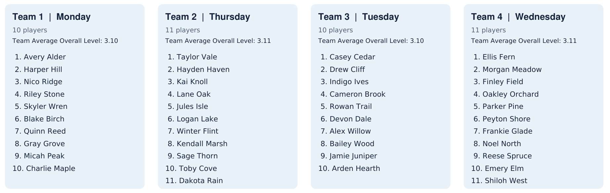
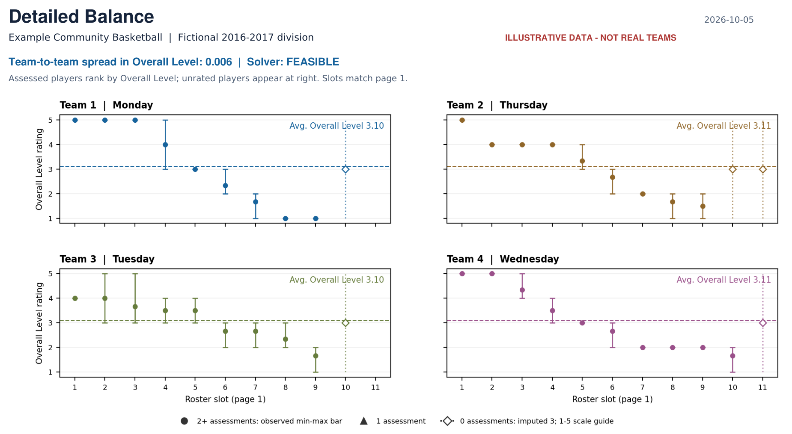

# Auto Drafter

Create balanced recreational basketball teams and share a clear PDF explaining
the draft. Preview coach-requested swaps or player withdrawals against a frozen
baseline, then compare the immediate change with a complete reoptimization.

Google OR-Tools solves the constrained draft. Team eligibility, practice
blackouts and team sizes are hard constraints. Overall Level balance leads the
optimization, with staged friendship and player-mix preferences. The detailed
methodology and limitations are in [the drafter guide](auto_drafter_README.md).

## Example reports





These examples use entirely fictional players and assessments.

[Team Draft Report](examples/example_teams_report.pdf) ·

[Change-request comparison](examples/example_change_request_report.pdf)

## Quick start

Use Python 3.10 or newer with your Python environment active. Run commands from
this repository's root:

```bash
pip install -r requirements.txt
```

For a **fresh Git clone only**, create the local input folder from the tracked
templates first (this command refuses to overwrite an existing `data/` folder):

```bash
python -c "import shutil; shutil.copytree('templates/data', 'data')"
```

1. Populate `data/constraints.csv` with the roster and constraints. Names and DOB
   are required; DOB uses MM/DD/YYYY. Blank `Team` means unrestricted, one number
   fixes that team, and `2 3`, `2 or 3`, or `2 and 3` allow either listed team.
2. Add coach evaluation CSVs to `data/evaluations/`. Rename or replace the single
   header-only `evaluations.csv` template and add any number of evaluation files.
   Recognized spreadsheet preambles and metric headers are supported.
3. Set team IDs and practice days in `data/teams_config.csv`. The starter includes
   the current four-team mapping as an editable example; team count comes from it.
4. Optionally fill `templates/report_config_template.csv` with one club/division
   row and save it as `data/report_config.csv`. Do not install a header-only
   personalization file.
5. Run the draft:

```bash
python auto_drafter.py
```

Review `output/teams_report.pdf` and the accompanying evidence and friendship
reports. The starter contains no player records, evaluations, saved baselines
or generated reports; populate the inputs before running it.

## Preview and accept changes

Freeze the reviewed draft once:

```bash
python change_requests.py --capture-baseline --from-run output/latest_draft.json
```

Enter proposals in `data/change_requests.csv`, then run:

```bash
python change_requests.py
```

Two player names request a swap. Leaving **Player B and Player B DOB blank**
requests withdrawal of Player A. Each PDF compares baseline, exact change and
reoptimized teams. Rows sharing a Proposal name form a combined request;
different names are independent alternatives. A preview keeps the baseline
unchanged. See [the change-request guide](change_requests_README.md) for the
acceptance command and how to rerun outstanding proposals against the new
baseline after acceptance.

## Repository contents

| Path | Purpose |
| --- | --- |
| `auto_drafter.py` | Prepare input data and optimize teams |
| `teams_report.py` | Generate the draft PDF and balance charts |
| `change_requests.py` | Preview and accept swaps or withdrawals |
| `auto_drafter_README.md` | Input formats, methodology, configuration and outputs |
| `change_requests_README.md` | Baseline, proposal and acceptance workflows |
| `requirements.txt` | Tested direct dependency pins |
| `templates/` | Tracked input headers and example team configuration |
| `data/` | Local populated inputs; ignored by Git |
| `output/` | Local reports and snapshots; ignored by Git |

The dependency pins come from the environment used for the project checks;
transitive dependencies are resolved by pip. Replace them with your own frozen
requirements if you prefer to reproduce your local environment exactly.
